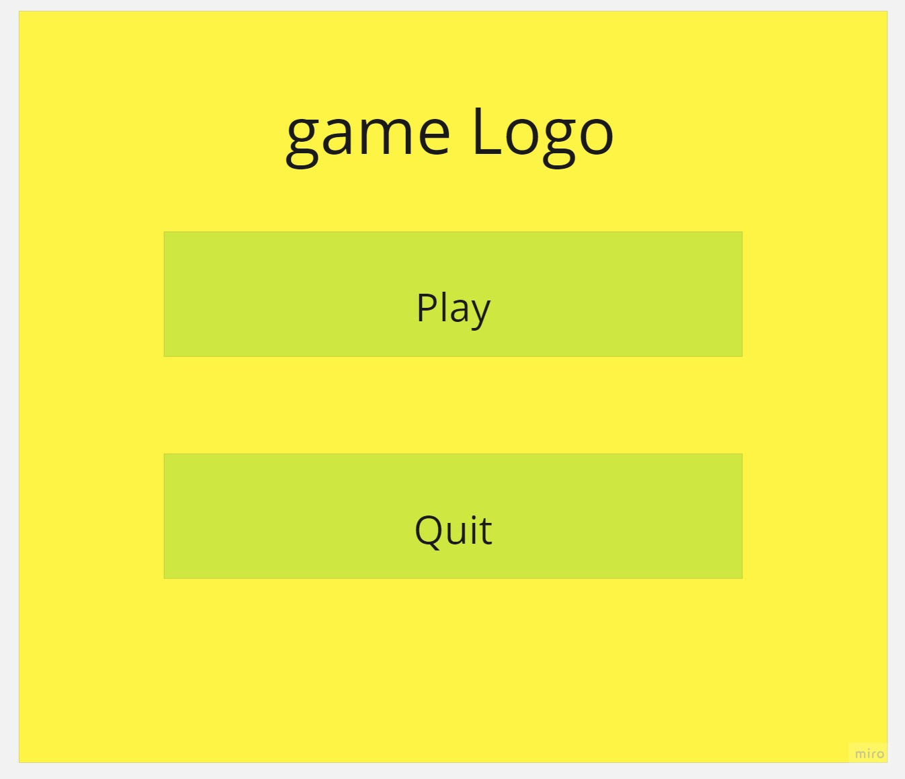

# Wireframes-and-software-requirements

## Wireframes

## User Stories

### Story Number 1

as a father, i want a game to play with my son on the same device.

Feature Tasks:
- the game should support 2 player so you can play with your close ones

- the game should suport controler so one of the player can use the controler.

Acceptance Tests:
- the game should show two character on the same screen

- the game should work with the controler

## Software Requirements

[Software Requirements](requirements.md)

## Domain Modeling

under some work
